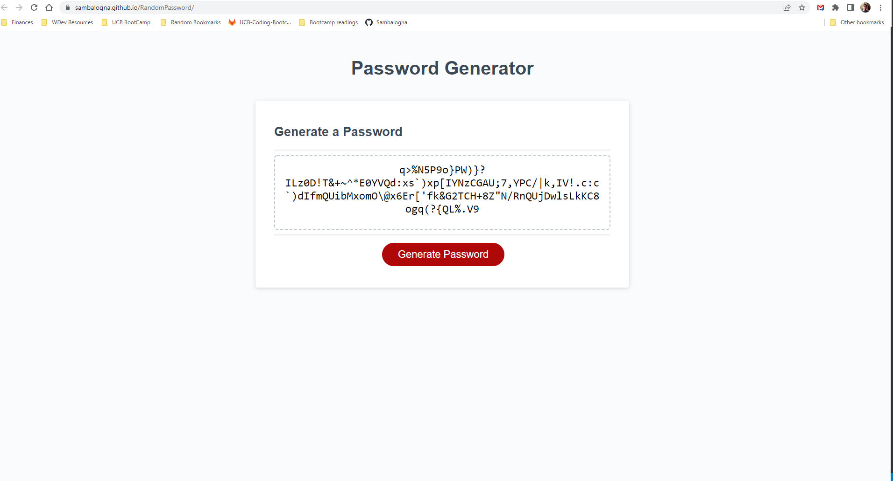

# portfolio_update

## Description

This is an update to my original Portfolio page. The site uses Bootstrap v4.5 to create a responsive layout. The navbar is responsive and switches to a toggle menu for mobile sized screens. The images and their carousels are also responsive to the webpages size. There are additional links throughout the site, starting with the navigation menu there are links to specific portions of the page as well as my GitHub. My Github is also located at the bottom of the page with the footer as well as the contact information that includes my LinkedIn, Resume and Github.

## Technologies Used
*HTML
*CSS
*Bootstrap v4.5
*JQuery UI
*JQuery
*JQuery UI CSS

## Site 

[Portfolio](https://sambalogna.github.io/portfolio_update/)

## Key Coding Snippets
These are the required links to external style sheets to ensure Bootstrap is applying v4.5 and jquery UI.
````HTML
   <link rel="stylesheet" href="https://cdnjs.cloudflare.com/ajax/libs/twitter-bootstrap/4.5.0/css/bootstrap.min.css">
    <link rel="stylesheet" href="https://code.jquery.com/ui/1.12.1/themes/base/jquery-ui.css">
    
````
The end of the body includes these scripts to ensure all of Bootstraps styles are applied and working as intended. Specifically, Jquery then Bootstrap will get the image carousels to work properly. 
````HTML
<script src="https://cdnjs.cloudflare.com/ajax/libs/jquery/3.5.1/jquery.min.js"></script>
<script src="https://cdnjs.cloudflare.com/ajax/libs/twitter-bootstrap/4.5.0/js/bootstrap.min.js"></script>

````
Bootstrap Carousels are the main portion of the page, specifically these carouself work well in BootStrap v4.5. There are updates to this model in Bootstrap v5.0. 

Each image opens the respective project being shown with a small caption describing the project.
````HTML
 <div class="container">
        <div class="row align-items-start">
            <div class="col-sm-12 projectContainer">
              <div id="carouselExampleCaptions" class="carousel slide " data-ride="carousel">
                <ol class="carousel-indicators">
                  <li data-target="#carouselExampleCaptions" data-slide-to="0" class="active"></li>
                  <li data-target="#carouselExampleCaptions" data-slide-to="1"></li>
                  <li data-target="#carouselExampleCaptions" data-slide-to="2"></li>
                </ol>
                <div class="carousel-inner">
                  <div class="carousel-item active ">
                    <a href="https://sambalogna.github.io/date-night-and-chill/" target="_blank">
                        
                    </a>
                    <div class="carousel-caption d-none d-md-block">
                        <h5>Date Night</h5>
                        <p>A quick app to generate a date easily!</p>
                    </div>
                  </div>
                  <div class="carousel-item ">
                    <a href="https://sambalogna.github.io/weatherDashboard/" target="_blank">
                    
                    </a>
                    <div class="carousel-caption d-none d-md-block">
                        <h5>Weather Dashboard</h5>
                        <p>Utilizes weather API to query weather based on longitude and latitude.</p>
                    </div>
                  </div>
                  <div class="carousel-item">
                    <a href="https://sambalogna.github.io/RandomPassword/" target="_blank">
                    
                    </a>
                    <div class="carousel-caption d-none d-md-block">
                      <h5>Random Password</h5>
                      <p>A random password generator.</p>
                    </div>
                  </div>
                </div>
                <a class="carousel-control-prev" href="#carouselExampleCaptions" role="button" data-slide="prev">
                  <span class="carousel-control-prev-icon" aria-hidden="true"></span>
                  <span class="sr-only">Previous</span>
                </a>
                <a class="carousel-control-next" href="#carouselExampleCaptions" role="button" data-slide="next">
                  <span class="carousel-control-next-icon" aria-hidden="true"></span>
                  <span class="sr-only">Next</span>
                </a>
              </div>
            </div>
````


## License
MIT License

Copyright (c) 2022 MSM

Permission is hereby granted, free of charge, to any person obtaining a copy of this software and associated documentation files (the "Software"), to deal in the Software without restriction, including without limitation the rights to use, copy, modify, merge, publish, distribute, sublicense, and/or sell copies of the Software, and to permit persons to whom the Software is furnished to do so, subject to the following conditions:

The above copyright notice and this permission notice shall be included in all copies or substantial portions of the Software.

THE SOFTWARE IS PROVIDED "AS IS", WITHOUT WARRANTY OF ANY KIND, EXPRESS OR IMPLIED, INCLUDING BUT NOT LIMITED TO THE WARRANTIES OF MERCHANTABILITY, FITNESS FOR A PARTICULAR PURPOSE AND NONINFRINGEMENT. IN NO EVENT SHALL THE AUTHORS OR COPYRIGHT HOLDERS BE LIABLE FOR ANY CLAIM, DAMAGES OR OTHER LIABILITY, WHETHER IN AN ACTION OF CONTRACT, TORT OR OTHERWISE, ARISING FROM, OUT OF OR IN CONNECTION WITH THE SOFTWARE OR THE USE OR OTHER DEALINGS IN THE SOFTWARE.
